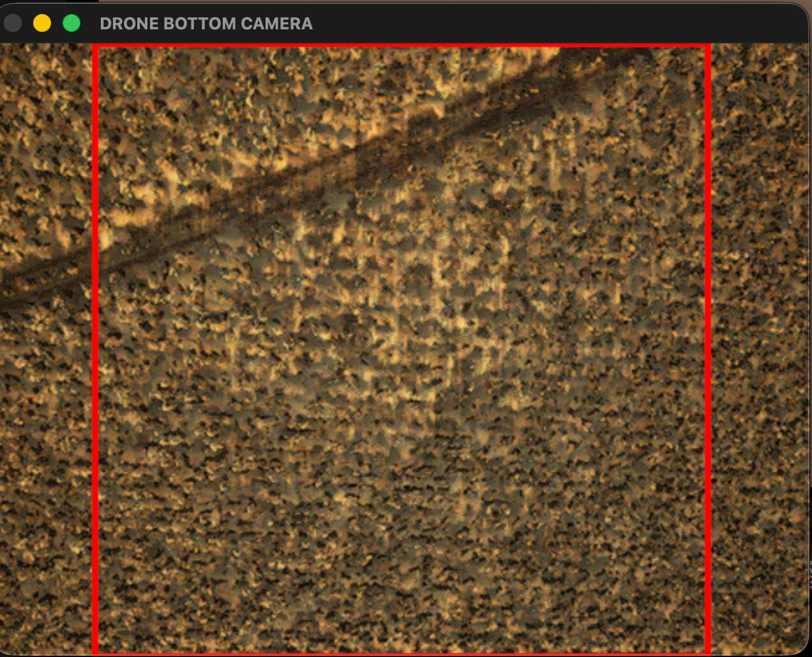
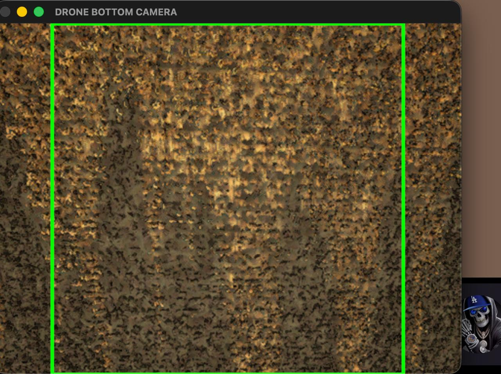

# 🚁 AgroTech AI: Drone Autopilot with Computer Vision

Система машинного зрения и автопилота для сельскохозяйственного дрона. Проект позволяет дрону (через протокол INAV / MSP) летать по заданному маршруту (змейкой) и в реальном времени анализировать поле с помощью сверточной нейросети, отличая посадки от пустой земли и следов трактора.

## 🧠 Архитектура модели
В основе лежит архитектура **MobileNetV2** (Transfer Learning), оптимизированная для работы в реальном времени.

* **Входные данные:** Центрированные фрагменты с камеры дрона (Center Crop, 224x224 RGB).
* **Аугментация:** Защита от теней (`RandomBrightness`, `RandomContrast`) и перепадов высоты (`RandomZoom`).
* **Точность (Accuracy):** ~96% на сложном датасете из 5500+ изображений.

## 📂 Структура проекта
* `main.py` — Скрипт подготовки данных, аугментации и обучения нейросети (TensorFlow/Keras).
* `autopilot_1.py` — Скрипт связи с симулятором INAV, отправки маршрута и инференса нейросети в полете.
* `requirements.txt` — Зависимости проекта.

> *Внимание: датасеты и веса моделей `.keras` / `.pkl` находятся в `.gitignore` и не выгружаются в репозиторий в целях оптимизации.*

## 🛠 Установка и запуск

**1. Клонируйте репозиторий:**
```bash
git clone [https://github.com/ТВОЙ_НИК/agro-drone-ai.git]
```

**2. Установите зависимости:**
```bash
pip install -r requirements.txt
```

**3. Для обучения модели (нужно положить свои фото в папку dataset/):**
```bash
python main.py
```

**4. Для запуска автопилота:**
```bash
python autopilot_1.py
```

## 📊 Демонстрация работы

| Распознавание посадок | Пустая земля / Следы |
| :---: | :---: |
|  |  |

*Пример работы нейросети в симуляторе: модель успешно отличает грядки (зеленый индикатор) от теней и следов трактора (красный индикатор).*